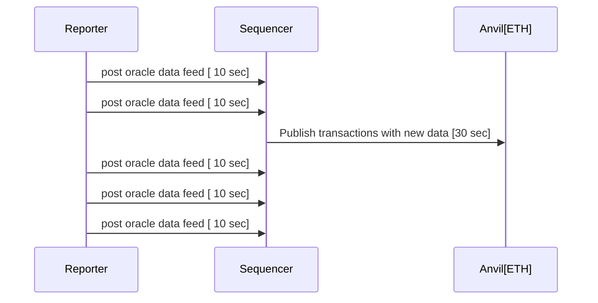

# Repository for ETHSofia 17-19 Oct Hackaton

Welcome to ETHSofia 17-19 Oct Hackaton. To participate in hackaton you need to setup blocksense network in your local machine.

Install git, [docker compose](https://docs.docker.com/compose/install/) & [rust](https://www.rust-lang.org/tools/install). Currently we only support rust for writing oracle scripts. It's technologically possible to use other languages, but this is out of the scope for this hackaton because our SDK is only available for rust. So you need to get rusty !
Your first goal is to run one of our oracle script to verify all services are running and set up correctly.

1. Clone this repository:

   ```bash
   git clone git@github.com:blocksense-network/ethsofia_hackaton.git
   ```

   or

   ```bash
   git clone https://github.com/blocksense-network/ethsofia_hackaton.git
   ```

> [!IMPORTANT]
> For Mac users you need to switch to `mac_images` branch. All the instructions apply for Mac & Linux.

2. Then download out pre-build images with following command

   ```bash
   docker compose pull
   ```

3. Make sure you have rust compiler with wasm32-wasi target:

   ```bash
   cargo -V
   rustup target add wasm32-wasi
   ```

## Running an available Oracle Script

### Run wasm revolut reporter

To run wasm revolut reporter you need to build it:

```bash
cd examples/revolut && cargo update && cargo build --target wasm32-wasi --release
```

Now go to root directory of this repository and start all the containers:

```bash
docker compose up
```

This will launch 2 local ETH blockchains (anvil), blocksense sequencer service which is responsible for publishing oracle scripts data feeds to the ETH blockchain and one reporter which will execute your oracle script and push its data feed to sequencer.



The system is designed to handle many decentralized oracles, but for this hackaton we will use only one reporter that executes one oracle script.
If everything works correctly you will have one oracle script that reports one price feed. In the docker compose output you can see something like:

```log
sequencer-1   | 2024-10-15T14:57:08.291818Z DEBUG sequencer::http_handlers::data_feeds: Recvd result from reporter[0]: Numerical(64680.51629596154)
sequencer-1   | 2024-10-15T14:57:08.291843Z DEBUG sequencer::http_handlers::data_feeds: getting feed_id = 31
sequencer-1   | 2024-10-15T14:57:08.291861Z DEBUG feed_registry::types: Accepted report!
```

---

### Run wasm yahoo reporter

Next step is to change the oracle script in the reporter with more sophisticated one. Which uses Yahoo finance with your private API key

Register at [Yahoo finance API](https://financeapi.net/dashboard) and paste the API key in this directory in file:

`examples/yahoo/spin.toml` in section:

```toml
[[trigger.oracle.capabilities]]
data = "xxxxxxxxxxxxxxxxxxxxxxxxxxxxxxxxxxxxxxxx"
id = "YAHOO_API_KEY"
```

Now build the yahoo reporter:

```bash
cd examples/yahoo && cargo update && cargo build --target wasm32-wasi --release
```

Go to the main directory in the repository and enable yahoo entrypoint of the `reporter` service in `docker-compose.yml`

```yaml
entrypoint:
  ["/bin/sh", "-c", "cd /usr/local/blocksense/oracles/yahoo && /spin up"]
```

Start docker compose again. That will start 2 anvil instances, one sequencer and a yahoo reporter

```bash
  docker compose down # if you have already running containers
  docker compose up
```

If everything is setup correctly you will see anvil reporting published transactions:

```bash
  docker compose logs anvil-a
```

```log

anvil-a-1 | Genesis Timestamp

anvil-a-1 | ==================

anvil-a-1 |

anvil-a-1 | 1728549718

anvil-a-1 |

anvil-a-1 | Listening on 0.0.0.0:8545

anvil-a-1 | eth_blockNumber

anvil-a-1 | eth_getCode

anvil-a-1 | eth_gasPrice

anvil-a-1 | eth_chainId

anvil-a-1 | eth_getTransactionCount

anvil-a-1 | eth_sendRawTransaction

anvil-a-1 |

anvil-a-1 | Transaction: 0x92befeefef33dc231e696f65a69502609452f2179fb1a5e9c95842081ab4c5d1

anvil-a-1 | Gas used: 21328

anvil-a-1 |

anvil-a-1 | Block Number: 1

anvil-a-1 | Block Hash: 0x0d2ebeea50b02beebfbe50a310871773fa186da61a386bb9dcb2d3df97a4bb5a

anvil-a-1 | eth_blockNumber

anvil-a-1 | Block Time: "Thu, 10 Oct 2024 08:42:30 +0000"

anvil-a-1 |

anvil-a-1 | eth_getBlockByNumber

anvil-a-1 | eth_getTransactionReceipt

anvil-a-1 | eth_blockNumber

anvil-a-1 | eth_blockNumber

anvil-a-1 | eth_blockNumber

anvil-a-1 | eth_blockNumber

anvil-a-1 | eth_gasPrice

anvil-a-1 | eth_chainId

anvil-a-1 | eth_sendRawTransaction

anvil-a-1 |

anvil-a-1 | Transaction: 0x5fac5e16d81fab79649b9d80752305eede9b718ba54cb6e1433372429088f1c9

anvil-a-1 | Gas used: 21316

anvil-a-1 |

anvil-a-1 | Block Number: 2

anvil-a-1 | Block Hash: 0xd95ca48a9c898f93a4f15b5d7321f7f82de9928e3f3f6f44caab4b33bd9d9fa7

anvil-a-1 | Block Time: "Thu, 10 Oct 2024 08:43:00 +0000"

anvil-a-1 |

```

### Using a similar approach you can use CoinMarketCap wasm reporter

Add CoinMarketCap key from this registration

Register at https://coinmarketcap.com/api/pricing/ and paste API key in this directory in file

`examples/cmc/spin.toml` in section:

```toml
[[trigger.oracle.capabilities]]
data = "00000000-0000-0000-0000-000000000000"
id = "CMC_API_KEY"
```

Now build the cmc reporter:

```bash
cd examples/cmc && cargo update && cargo build --target wasm32-wasi --release
```

Again at the `reporter` service in `docker-compose.yml` enable the cmc entrypoint

```yaml
entrypoint:
  ["/bin/sh", "-c", "cd /usr/local/blocksense/oracles/cmc && /spin up"]
```

You can now start docker compose again.

```bash
  docker compose down # if you have already running containers
  docker compose up
```

If everything is setup correctly you will see anvil reporting published transactions.

## Reading on-chain data

Once having all set up and running you can read the data from the blockchain.
For more information of how our Smart Contracts work navigate to the [Blocksense Smart Contract Documentation](https://docs.blocksense.network/docs/contracts)

There is a couple of ways to read the data from the blockchain. As mentioned above, we have anvil instances running, which are local Ethereum blockchains. We deploy our smart contracts on these blockchains and we can interact with them using different tools.

### Using `cast`

One approach could be to use the `cast` tool. `cast` is a command line tool that allows you to interact with the blockchain. You can find more information about it [here](https://book.getfoundry.sh/cast/).

Here is an example of how to use `cast` to read the data from the blockchain:

```bash
cast call 0xc04b335A75C5Fa14246152178f6834E3eBc2DC7C --data 0x8000001f --rpc-url http://127.0.0.1:8545 |  cut -c1-50 | cast to-dec
```

Lets break down the command:

1. We make a call to the contract with address `0xc04b335A75C5Fa14246152178f6834E3eBc2DC7C`. This is our [UpgradeableProxy](https://docs.blocksense.network/docs/contracts/reference-documentation/UpgradeableProxy) contract.

2. We pass the data `0x8000001f` to the contract. This way you interact with the `fallback` function of the `UpgradeableProxy` contract. More info on this can be found [here](https://docs.blocksense.network/docs/contracts#call-handling-mechanism). This call allows us to read the latest price and timestamp. One question you might have at this point is how to craft this selector. In one handy way is to use `node repl` or `js` as follows:

```javascript
const id = 31;
const selector = "0x" + ((id | 0x80000000) >>> 0).toString(16).padStart(8, "0");
console.log(selector);
// '0x8000001f'
```

Note that the `id` is the id of the data feed you want to read data for. In this case with id 31 we are reading the price of `BTC/USD` data feed. You can confirm that by navigating to `config/feed_config.json` file or in the `spin.toml` file of any oracle script.

3. We pass the `rpc-url` of the anvil instance we want to interact with. In this case we are using the first anvil instance.

4. We pipe the output to `cut` to get only the first 50 characters of the output. This is because they refer to the price itself. The output is in hex format and we want to convert it to decimal. We can do that by piping the output to `cast to-dec`.

Expected result must be something like `67260166034648270000000` which is the price of BTC/USD in the moment of the call.

> Note: Potential issues
>
> - If the result is 0 that means the reporter is not running correctly.
> - If you receive an error that could be due to the fact that the smart contract is not deployed on the blockchain.

### Using `ethers.js`

We have examples for interacting with `UpgradeableProxy` contract using `ethers.js` [here](https://docs.blocksense.network/docs/contracts/integration-guide/using-data-feeds/historic-data-feed#ethersjs-v6x).

### Using `solidity`

We have examples for interacting with `UpgradeableProxy` contract using `solidity` [here](https://docs.blocksense.network/docs/contracts/integration-guide/using-data-feeds/historic-data-feed#solidity).

## Creating your own new Oracle Script

This is the main task of this hackaton - to create your oracle script, feed data to the blockchain and do something interesting or useful with it. To achieve your goal we suggest to use copy-paste-edit strategy with one of our existing oracles.

For example:

```bash
cd examples && cp -r revolut my_oracle
```

edit `my_oracle/spin.toml`:

```toml
spin_manifest_version = 2

[application]
authors = ["Your names"]
name = "Blocksense Oracle Hackaton"
version = "0.1.0"

[application.trigger.settings]
interval_time_in_seconds = 10 # reporting interval in seconds. Adjust if necessary
sequencer = "http://sequencer:8877/post_report"
secret_key = "536d1f9d97166eba5ff0efb8cc8dbeb856fb13d2d126ed1efc761e9955014003"
reporter_id = 0

[[trigger.oracle]]
component = "your-awesome-script"

[[trigger.oracle.data_feeds]]
id = "47" #UPDATE DATA FEEDS IF NEEDED
data = "USD/ETH"

[[trigger.oracle.data_feeds]]
id = "31"
data = "USD/BTC"

[component.your-awesome-script]
source = "target/wasm32-wasi/release/my-awesome-oracle.wasm"
allowed_outbound_hosts = [
"https://awesome-data-feed.com",
]
[component.your-awesome-script.build]
command = "cargo build --target wasm32-wasi --release"
```

Edit `my_oracle/Cargo.toml`:

```toml
[package]
name = "my-awesome-oracle"
authors = ["Your name"]
description = ""
version = "0.1.0"
edition = "2021"

[lib]
crate-type = ["cdylib"]

[dependencies]
wit-bindgen = "0.16.0"
blocksense-sdk = { git = "https://github.com/blocksense-network/sdk.git" }
anyhow = "1.0.82"
serde_json = "1.0"
url = "2.5"
serde = { version = "1.0", features = ["derive"] }

# Add extra dependencies here, if needed

```

If you need a new data feed for your application you can appended to
`config/feed_config.json`

```json
    {
      "id": 42, # Pick some ID that is not occupied, or you can reuse existing one ( but let it be between 0 and 257 )
      "name": "MyToken",
      "fullName": "",
      "description": "MyToken / USD",
      "decimals": 8,
      "report_interval_ms": 30000,
      "quorum_percentage": 1, # Leave unchannged
      "type": "Crypto",
      "script": "CoinMarketCap",
      "pair": {
        "base": "MyToken",
        "quote": "USD"
      },
      "first_report_start_time": {
        "secs_since_epoch": 0,
        "nanos_since_epoch": 0
      },
      "resources": {
        "cmc_id": 123456,
        "cmc_quote": "MyToken"
      }
    },
```

Write the code for your oracle and build it.

Edit `docker-compose.yaml` to start your oracle script:

```yaml
  reporter:
    image: ymadzhunkov/blocksense_hackaton:reporter
    networks:
      - backend
    volumes:
      - ./examples/yahoo:/usr/local/blocksense/oracles/yahoo
      - ./examples/revolut:/usr/local/blocksense/oracles/revolut
      - ./examples/cmc:/usr/local/blocksense/oracles/cmc
      - ./examples/my_oracle:/usr/local/blocksense/oracles/my_oracle
entrypoint: ['/bin/sh', '-c', 'cd /usr/local/blocksense/oracles/my_oracle && /spin up']
    depends_on:
      sequencer:
        condition: service_healthy
```

Restart the entire setup:

```bash
docker compose down
docker compose up
```
