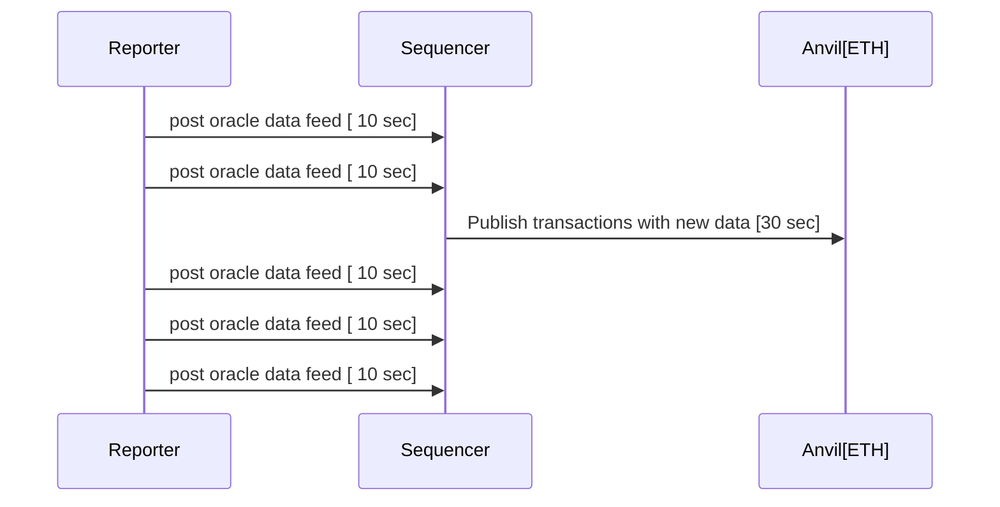

# Repository for ETHSofia 17-19 Oct Hackaton

  

Welcome to ETHSofia 17-19 Oct Hackaton. To participate in hackaton you need to setup blocksense network in your local machine.

Install git, [docker compose](https://docs.docker.com/compose/install/) & [rust](https://www.rust-lang.org/tools/install). Currently we only support rust for writing oracle scripts. It's technologically possible to use other languages, but this is out of the scope for this hackaton because our SDK is only available for rust. So you need to get rusty !
Your first goal is to run one of our oracle script to verify all services are running and set up correctly.

First download out pre-build images with following command
For Mac users you need to switch to `mac_images` branch. All the instructions apply for Mac & Linux.

`docker compose pull` 
Make sure you have rust compiler:
`cargo -V`
with wasm32-wasi target
`rustup target add wasm32-wasi`

## Running an available Oracle Script
  

### To run wasm yahoo repoter you need to build it:

`cd examples/revolut && cargo update && cargo build --target wasm32-wasi --release`

Go to root directory of this repository and start all the containers:
`docker compose up`

This will launch 2 local ETH blockchains (anvil), blocksense sequencer service with is responsible for publishing oracle scripts data feeds to the ETH blockchain and one reporter which will execute your oracle script and push it's data feed to sequencer. 


The system is design to handle many decentralized oracles, but for this hackaton we will use only one reporter that executes one oracle script.
If everything works correctly you will have one oracle script that reports one price feed. In the docker compose output you can see something like:

```
sequencer-1   | 2024-10-15T14:57:08.291818Z DEBUG sequencer::http_handlers::data_feeds: Recvd result from reporter[0]: Numerical(64680.51629596154)
sequencer-1   | 2024-10-15T14:57:08.291843Z DEBUG sequencer::http_handlers::data_feeds: getting feed_id = 31
sequencer-1   | 2024-10-15T14:57:08.291861Z DEBUG feed_registry::types: Accepted report!
```
  
---

Next step is to change the oracle script in the reporter with more sophisticated one. Which uses Yahoo finance with your private API key

Register at [Yahoo finance API](https://financeapi.net/#:~:text=Real%20time%20low%20latency%20Finance%20API%20for%20stock%20market,%20crypto) and paste API key in this directory in file:
 

`examples/yahoo/spin.toml` in section:
 

```

[[trigger.oracle.capabilities]]

data = "xxxxxxxxxxxxxxxxxxxxxxxxxxxxxxxxxxxxxxxx"

id = "YAHOO_API_KEY"

```

`cd examples/yahoo && cargo update && cargo build --target wasm32-wasi --release`
 
 Go to main directory in the repository and enable yahoo entrypoint in docker-compose.yml

`entrypoint: ['/bin/sh', '-c', 'cd /usr/local/blocksense/oracles/yahoo && /spin up']`
 

Start docker compose which start 2 anvil instances, one sequencer and yahoo reporter
`docker compose down`
`docker compose up`
  

If everything is setup correctly you will see anvil reporting published transactions:

  

```

anvil-a-1 | Genesis Timestamp

anvil-a-1 | ==================

anvil-a-1 |

anvil-a-1 | 1728549718

anvil-a-1 |

anvil-a-1 | Listening on 0.0.0.0:8545

anvil-a-1 | eth_blockNumber

anvil-a-1 | eth_getCode

anvil-a-1 | eth_gasPrice

anvil-a-1 | eth_chainId

anvil-a-1 | eth_getTransactionCount

anvil-a-1 | eth_sendRawTransaction

anvil-a-1 |

anvil-a-1 | Transaction: 0x92befeefef33dc231e696f65a69502609452f2179fb1a5e9c95842081ab4c5d1

anvil-a-1 | Gas used: 21328

anvil-a-1 |

anvil-a-1 | Block Number: 1

anvil-a-1 | Block Hash: 0x0d2ebeea50b02beebfbe50a310871773fa186da61a386bb9dcb2d3df97a4bb5a

anvil-a-1 | eth_blockNumber

anvil-a-1 | Block Time: "Thu, 10 Oct 2024 08:42:30 +0000"

anvil-a-1 |

anvil-a-1 | eth_getBlockByNumber

anvil-a-1 | eth_getTransactionReceipt

anvil-a-1 | eth_blockNumber

anvil-a-1 | eth_blockNumber

anvil-a-1 | eth_blockNumber

anvil-a-1 | eth_blockNumber

anvil-a-1 | eth_gasPrice

anvil-a-1 | eth_chainId

anvil-a-1 | eth_sendRawTransaction

anvil-a-1 |

anvil-a-1 | Transaction: 0x5fac5e16d81fab79649b9d80752305eede9b718ba54cb6e1433372429088f1c9

anvil-a-1 | Gas used: 21316

anvil-a-1 |

anvil-a-1 | Block Number: 2

anvil-a-1 | Block Hash: 0xd95ca48a9c898f93a4f15b5d7321f7f82de9928e3f3f6f44caab4b33bd9d9fa7

anvil-a-1 | Block Time: "Thu, 10 Oct 2024 08:43:00 +0000"

anvil-a-1 |

```

  

### Using a similar approach you can use CoinMarketCap wasm repoter

  

To run wasm yahoo repoter you need to build it:

`cd examples/cmc && cargo build --target wasm32-wasi --release`

  

Add CoinMarketCap key from this registration

  

Register at https://coinmarketcap.com/api/pricing/ and paste API key in this directory in file

  

`examples/cmc/spin.toml`

  

Enable yahoo entrypoint in docker-compose.yml

`entrypoint: ['/bin/sh', '-c', 'cd /usr/local/blocksense/oracles/cmc && /spin up']`

  

Start docker compose which start 2 anvil instances, one sequencer and yahoo reporter

`docker compose up`

  

If everything is setup correctly you will see anvil reporting published transactions.

  

## Adding a new Oracle Script

  

To create an oracle script you must create a new Rust project with cargo

  

```cargo new --lib my_oracle```

  

Open `./my_oracle/Cargo.toml` and under `[lib]` add the crate type - `crate-type = ["cdylib"]`

  

the following two dependencies should be included -

```

wit-bindgen = "0.16.0"

blocksense-sdk = { git = "https://github.com/blocksense-network/sdk.git" }

```

  

After this your Cargo.toml should look like this -

  

```

[package]

name = "my_oracle"

authors = ["Participant"]

description = ""

version = "0.1.0"

edition = "2021"

  

[lib]

crate-type = ["cdylib"]

  

[dependencies]

wit-bindgen = "0.16.0"

blocksense-sdk = { git = "https://github.com/blocksense-network/sdk.git" }

```

  

in the command-line use `cargo add` to add new libraries in your project.

  

## Building a new Oracle Script

  

Once you create your script to build the project run -

  

`cargo update && cargo build --target wasm32-wasi --release`

  

To make your project visible in the docker container open `docker-compose.yml` in the root of the project

  

include your new oracle script in the reporter section with the correct path, it should look like this -

  

```

reporter:

image: ymadzhunkov/blocksense_hackaton:reporter

networks:

- backend

volumes:

- ./examples/my_oracle:/usr/local/blocksense/oracles/my_oracle

entrypoint: ['/bin/sh', '-c', 'cd /usr/local/blocksense/oracles/my_oracle && /spin up']

  

depends_on:

sequencer:

condition: service_healthy

```

  

After that run `docker compose up` to launch the system.

  

If you've made any changes to the script you need to rebuild the wasm binaries before launching -

 
`cargo build --target wasm32-wasi --release && docker compose up`save it to another location. 
